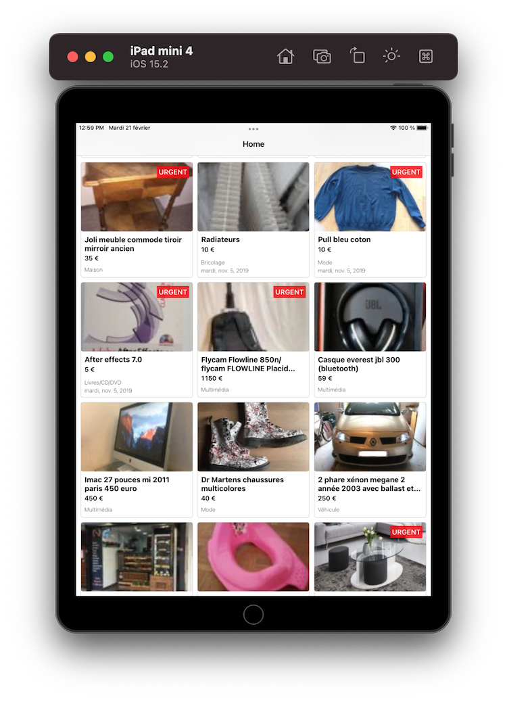

# Paperclip
<!-- Improved compatibility of back to top link: See: https://github.com/othneildrew/Best-README-Template/pull/73 -->
<a name="readme-top"></a>
<!--
*** Thanks for checking out the Best-README-Template. If you have a suggestion
*** that would make this better, please fork the repo and create a pull request
*** or simply open an issue with the tag "enhancement".
*** Don't forget to give the project a star!
*** Thanks again! Now go create something AMAZING! :D
-->


<!-- PROJECT SHIELDS -->
<!--
*** I'm using markdown "reference style" links for readability.
*** Reference links are enclosed in brackets [ ] instead of parentheses ( ).
*** See the bottom of this document for the declaration of the reference variables
*** for contributors-url, forks-url, etc. This is an optional, concise syntax you may use.
*** https://www.markdownguide.org/basic-syntax/#reference-style-links
-->


<!-- PROJECT LOGO -->
<br />
<div align="center">
  <a href="https://github.com/othneildrew/Best-README-Template">
    
  </a>

  <h3 align="center">iOS project</h3>

</div>


<!-- TABLE OF CONTENTS -->
<details>
  <summary>Table of Contents</summary>
  <ol>
    <li>
      <a href="#about-the-project">About The Project</a>
      <ul>
        <li><a href="#project-file-structure">Project File Structure</a></li>
        <li><a href="#prerequisites">Prerequisites</a></li>
        <li><a href="#built-with">Built With</a></li>
      </ul>
    </li>
    <li><a href="#roadmap">Roadmap</a></li>
    <li><a href="#license">License</a></li>
    <li><a href="#contact">Contact</a></li>
  </ol>
</details>


<!-- ABOUT THE PROJECT -->
## About The Project

<p align="middle">



</p>
Ce projet pourrait être utilisé comme un projet de base pour n'importe quel nouveau projet iOS.


<p align="right">(<a href="#readme-top">back to top</a>)</p>

### Project File Structure


### Prerequisites
Compatible iOS 14 +
<br>
Xcode version >= 13.2 (pour avoir Swift Concurrency)


### Built With

* Clean Architecutre (Presentation, Domain, Data) | Screaming Architecture
* Dependency Injection
* Intéraction entre les couches via : 
  - Swift Concurrency : Async/Await (Presentation --> Domain) (Data ---> Domain)
* Couche Presentation : 
  - UIKit : sans storyboard sans xib 
  - MVVM-C : Model View ViewModel - Coordinator (responsable de la navigation)
  - Combine : Interaction entre (ViewController <--> ViewModel)
* Couche Data : 
  - Networking : URLSession (via un protocol "NetworkingClient")
  - Local Storage : CoreData
* Tests : Les tests sont écrits en utilisant XCTest

<p align="right">(<a href="#readme-top">back to top</a>)</p>


<!-- ROADMAP -->
## Roadmap

- [ ] Ajouter plus de UnitTests (Couches Data et Presentation)
- [ ] Ajouter un "ParserClient" pour pouvoir utiliser un parser personnalisé 
- [ ] Ajouter un "StreamParser" : dans le cas d'un retour serveur important (big json array) : stocker la réponse dans un fichier puis récupérer les éléments "one by one" pour ne pas saturer la mémoire. (voir l'exemple ci-dessous)
- [ ] Utiliser "UICollectionViewDataSourcePrefetching" pour avoir un scroll plus smooth
- [ ] Ajouter une lib type SwiftGen pour détecter les erreurs strings en "compilation time"
- [ ] Ajouter SwiftLint
- [ ] Multi-language Support
    - [ ] Français
- [ ] Ajouter dans README une section "Acknowledgments"

```Swift
// StreamParser

func parseUsersFromFile(atPath filePath: String, onUserParsed: @escaping (User) -> Void) {
    guard let inputStream = InputStream(fileAtPath: filePath) else {
        print("Impossible d'ouvrir le fichier.")
        return
    }
    inputStream.open()
    
    let bufferSize = 1024
    var buffer = [UInt8](repeating: 0, count: bufferSize)
    var data = Data()
    
    while inputStream.hasBytesAvailable {
        let bytesRead = inputStream.read(&buffer, maxLength: bufferSize)
        if bytesRead > 0 {
            data.append(&buffer, count: bytesRead)
            if let jsonArray = try? JSONSerialization.jsonObject(with: data, options: .allowFragments) as? [[String: Any]] {
                for jsonObject in jsonArray {
                    if let id = jsonObject["id"] as? Int, let name = jsonObject["name"] as? String {
                        let user = User(id: id, name: name)
                        onUserParsed(user)
                    }
                }
                data = Data() // réinitialiser le tampon de données
            }
        }
    }
}
```

<p align="right">(<a href="#readme-top">back to top</a>)</p>

<!-- LICENSE -->
## License

Distributed under the MIT License. See `LICENSE.txt` for more information.

<p align="right">(<a href="#readme-top">back to top</a>)</p>
